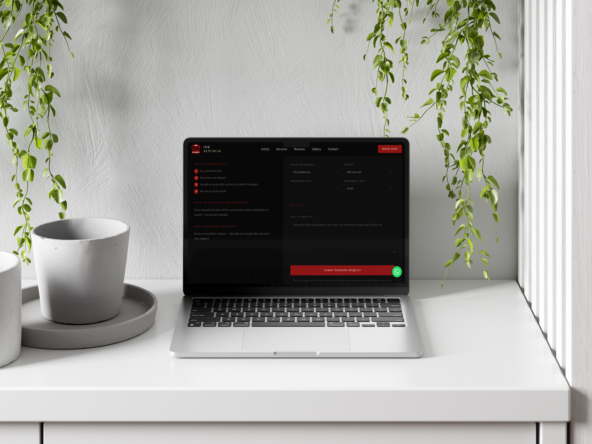
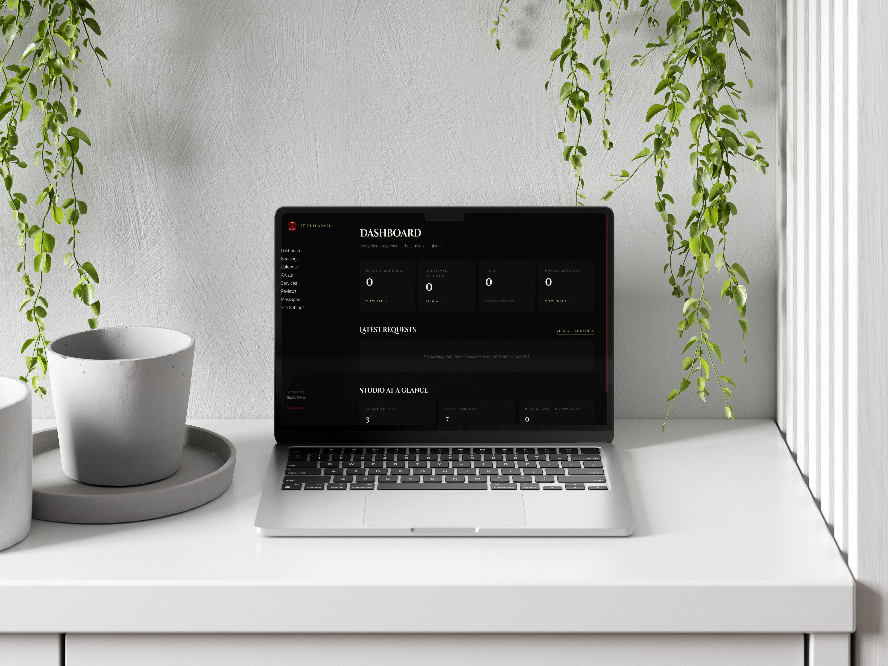

# Inkrepublik

A booking website and admin panel for a tattoo studio, built with ASP.NET Core and Blazor Server on .NET 10.

**[Live demo](https://inkrepublik.onrender.com/)** · Built solo by [Shine Chikwapulo](https://github.com/ShyneChikwapulo)

> **Status:** Portfolio project, designed around a tattoo studio in Hout Bay. It has not been presented to the studio yet and holds no real customer data. The hosted demo uses SQLite and local file storage on Render, so data can reset when the service redeploys.

<!-- Add screenshots to docs/screenshots/ and uncomment:



-->

## What it does

**For clients**
- Browse artists, services, a gallery and reviews.
- Submit a booking request through a validated form and receive a confirmation email.
- Use a private link to view the booking's status, request a new date or cancel it. Links use a 256-bit random token and expire after 30 days.

**For the studio (admin area)**
- Cookie-authenticated admin with passwords hashed by ASP.NET Core's password hasher.
- Pages for the dashboard, bookings (and booking detail), a calendar, artists, services, reviews, messages and site settings.
- Image uploads for artist and gallery content, checked for extension, size (5 MB) and file signature.

## Tech stack

| Area | Technology |
|---|---|
| Framework | .NET 10, ASP.NET Core, Blazor Server, Razor Pages (login) |
| Data | Entity Framework Core 10, SQL Server (development), SQLite (demo deployment) |
| Email | Resend HTTPS API, with a console fallback when no API key is set |
| Packaging | Docker (multi-stage build, non-root user), Docker Compose for local SQL Server |
| Hosting | Render |
| Tests | xUnit |

## Architecture

The solution has four projects plus a test project:

| Project | Responsibility |
|---|---|
| `Inkrepublik.Web` | Blazor components, the admin login pages, startup and dependency injection |
| `Inkrepublik.Domain` | Entities and enums (bookings, artists, services, reviews and so on) |
| `Inkrepublik.Data` | `DbContext`, EF Core migrations (SQL Server), idempotent database seeder |
| `Inkrepublik.Services` | Booking, admin, email and file-storage logic behind interfaces |
| `Inkrepublik.Tests` | xUnit project |

On startup the app applies migrations (SQL Server) or creates the schema (SQLite), then seeds sample data. The admin account is seeded only when both `Admin:Email` and `Admin:Password` are set.

## Getting started

**Prerequisites:** [.NET 10 SDK](https://dotnet.microsoft.com/download), [Docker Desktop](https://www.docker.com/products/docker-desktop/) (for local SQL Server).

```bash
git clone https://github.com/ShyneChikwapulo/inkrepublik.git
cd inkrepublik

# 1. Start SQL Server 2022 in Docker (port 1433)
docker compose up -d

# 2. Set an admin password (stored in .NET user secrets, not in the repo)
dotnet user-secrets set "Admin:Password" "<choose-a-strong-password>" --project src/Inkrepublik.Web

# 3. Run the app
dotnet dev-certs https --trust   # first time only
dotnet run --project src/Inkrepublik.Web --launch-profile https
```

Open <https://localhost:7112>. The admin login is at `/admin/login`, using the email from `Admin:Email` (the Development settings use `admin@inkrepublik.local`) and the password you set.

**No Docker?** Use SQLite instead:

```bash
DatabaseProvider=Sqlite dotnet run --project src/Inkrepublik.Web --launch-profile https
```

**Email.** Without a Resend API key, emails are written to the console log. To send real email:

```bash
dotnet user-secrets set "Resend:ApiKey" "re_..." --project src/Inkrepublik.Web
```

Resend's sandbox sender (`onboarding@resend.dev`) only delivers to the address you signed up with.

## Configuration

Set these as user secrets, `appsettings` values or environment variables (use `__` instead of `:` in environment variables).

| Key | Purpose |
|---|---|
| `DatabaseProvider` | `SqlServer` or `Sqlite` |
| `ConnectionStrings:DefaultConnection` | SQL Server connection string |
| `DatabasePath` | SQLite file path |
| `Resend:ApiKey`, `Resend:FromAddress`, `Resend:FromName` | Email via the Resend API |
| `Studio:OwnerEmail` | Where new-booking notifications go |
| `Studio:PublicBaseUrl` | Base URL used in emailed booking links |
| `Admin:Email`, `Admin:Password` | Admin account created on first start |

## Testing

```bash
dotnet test
```

The test project currently contains only a placeholder test. Real tests are on the roadmap.

## Docker and deployment

```bash
docker build -t inkrepublik .
docker run --rm -p 8080:8080 \
  -e ASPNETCORE_ENVIRONMENT=Production \
  -e DatabaseProvider=Sqlite \
  -e DatabasePath=/app/data/inkrepublik.db \
  -e Admin__Email=admin@example.com \
  -e Admin__Password='<choose-a-strong-password>' \
  -e Studio__PublicBaseUrl=http://localhost:8080 \
  inkrepublik
```

The image exposes port 8080 and runs as a non-root user. `/app/data` (database) and `/app/wwwroot/uploads` are writable. Mount volumes there if you need data to survive restarts.

## Roadmap

- Unit and integration tests for booking rules, token handling and admin authorisation
- Login hardening: validate the return URL, add rate limiting or lockout, mark the auth cookie `Secure` in production
- Persistent production storage (PostgreSQL and object storage for uploads)
- Facebook gallery sync (planned, not built)

## Author

Shine Chikwapulo · [GitHub](https://github.com/ShyneChikwapulo) · [LinkedIn](https://www.linkedin.com/in/shine-chikwapulo-741b20265/)
